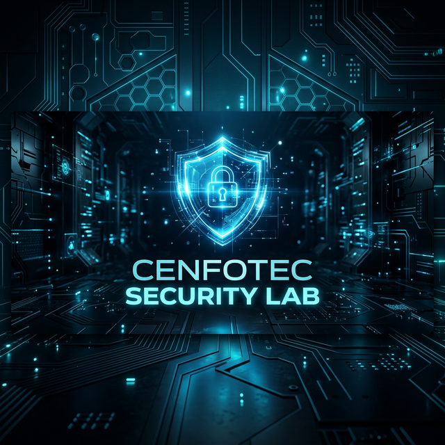

# 🛡️ Universidad Cenfotec | Security Master Lab



Este repositorio es el centro de operaciones para el estudio avanzado de **Seguridad de Aplicaciones y Bases de Datos**. Contiene un entorno comparativo diseñado para visualizar, explotar y mitigar vulnerabilidades críticas de seguridad.

---

## 🏛️ Estructura del Laboratorio

El laboratorio está dividido en dos ecosistemas distintos que permiten un análisis forense y preventivo del software:

### 🔴 [Entorno Inseguro (Vulnerable)](./seguridad/insecure-app/README.md)
*Simulación controlada de una aplicación con fallos críticos.*
- **Enfoque:** Explotación de SQL Injection.
- **Tecnología:** Flask, MySQL 5.7, Glassmorphism UI.
- **Objetivo:** Comprender la anatomía de un ataque y cómo la falta de saneamiento compromete el sistema.

### 🟢 [Entorno Seguro (Mitigado)](./seguridad/secure-app/)
*Implementación bajo estándares de seguridad industriales.*
- **Enfoque:** Defensa en profundidad.
- **Tecnologías:** SQLAlchemy (ORMs), Hashing de contraseñas, Manejo de sesiones seguras.
- **Objetivo:** Demostrar la implementación de controles compensatorios y preventivos.

---

## 🛠️ Requisitos de Operación

Para desplegar cualquiera de los entornos, es indispensable contar con las siguientes herramientas instaladas:

- **Plataforma:** [Docker Desktop](https://www.docker.com/products/docker-desktop/)
- **Orquestador:** Docker Compose (v2+)
- **Terminal:** PowerShell (Recomendado en Windows 11)

---

## 🚀 Despliegue Rápido (Quick Start)

Para iniciar cualquiera de las aplicaciones desde la raíz del proyecto, ejecute:

### Caso 1: Laboratorio Inseguro
```powershell
cd seguridad/insecure-app
docker-compose up -d --build
```
*Acceso local:* [http://localhost:5000](http://localhost:5000)

### Caso 2: Laboratorio Seguro
```powershell
cd seguridad/secure-app
docker-compose up -d --build
```
*Acceso local:* [http://localhost:5001](http://localhost:5001) *(Puerto por defecto del entorno seguro)*

---

## 🔬 Metodología de Uso

1.  **Exploración:** Inicie el entorno inseguro y utilice las guías de explotación para realizar un bypass de login.
2.  **Análisis:** Verifique los logs del contenedor para observar la consulta SQL generada.
3.  **Comparación:** Despliegue el entorno seguro e intente replicar el ataque anterior para verificar la efectividad de los controles implementados.
4.  **Documentación:** Revise los archivos `README.md` locales de cada aplicación para detalles técnicos específicos.

---

## ⚠️ Nota de Ética y Seguridad
Todo el material presente es estrictamente para **fines académicos**. La intención de este laboratorio es formar profesionales con capacidad de defensa y arquitectura robusta.

---
**Universidad Cenfotec 2026** | 
