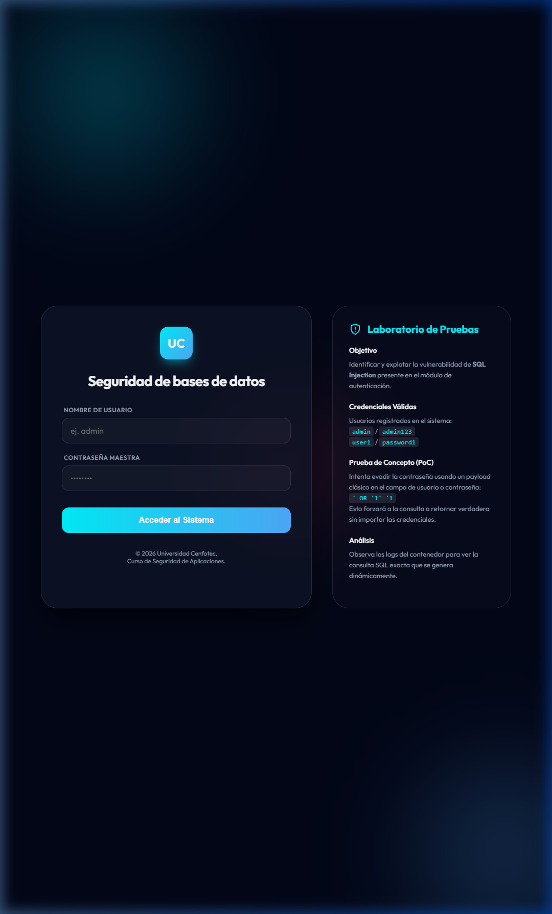

# 🔐 Security Lab | Universidad Cenfotec



Este es un entorno de laboratorio avanzado diseñado para el curso de **Seguridad de Bases de Datos**. El objetivo primordial es el estudio, identificación y mitigación de vulnerabilidades críticas, con un enfoque especial en **SQL Injection**.

---

## 🚀 Despliegue con Docker

De acuerdo con los estándares del curso, la aplicación se ejecuta exclusivamente en contenedores para garantizar un entorno controlado y reproducible.

### Requisitos
*   Docker Desktop
*   Docker Compose

### Instrucciones de Inicio (PowerShell)
1.  **Construir e iniciar los servicios:**
    ```powershell
    docker-compose up -d --build
    ```
2.  **Acceder al Laboratorio:**
    Navega a [http://localhost:5000](http://localhost:5000) en tu navegador.

---

## 🧪 Guía de Laboratorio: SQL Injection

La interfaz de login ha sido diseñada intencionalmente con una vulnerabilidad crítica de inyección SQL para propósitos educativos.

### 1. Usuarios Registrados
Puedes probar el acceso legítimo con:
*   **Admin:** `admin` / `admin123`
*   **Usuario:** `user1` / `password1`

### 2. Explotación (SQLi)
Para demostrar la vulnerabilidad, intenta "romper" la lógica de la consulta ingresando el siguiente payload en el campo de **Nombre de Usuario**:
```sql
' OR '1'='1
```
*(Puedes dejar la contraseña en blanco o ingresar cualquier valor)*

### ¿Por qué funciona?
La consulta generada dinámicamente en `app.py` es:
```python
query = f"SELECT * FROM users WHERE username = '{username}' AND password = '{password}'"
```
Al inyectar `' OR '1'='1`, la consulta resultante se convierte en:
```sql
SELECT * FROM users WHERE username = '' OR '1'='1' AND password = '...'
```
Como `'1'='1'` siempre es verdadero, la base de datos retorna el primer registro encontrado (generalmente el administrador), permitiendo el bypass total de la autenticación.

---

## 📁 Estructura del Proyecto

*   `app.py`: Servidor Flask con lógica de autenticación vulnerable.
*   `templates/`: Interfaz premium optimizada para el curso.
*   `static/`: Estilos CSS (Glassmorphism) y lógica JS (Ripple effects).
*   `init.sql`: Definición del esquema y carga inicial de datos.
*   `docker-compose.yml`: Orquestación del stack (Web + MySQL 5.7).

---

## ⚠️ Advertencia Académica
Este código tiene **fines estrictamente educativos**. Los patrones de seguridad (o la falta de ellos) aquí mostrados no deben ser utilizados en entornos de producción bajo ninguna circunstancia.

---
*Desarrollado para la especialización en Seguridad Informática - Universidad Cenfotec 2026.*

